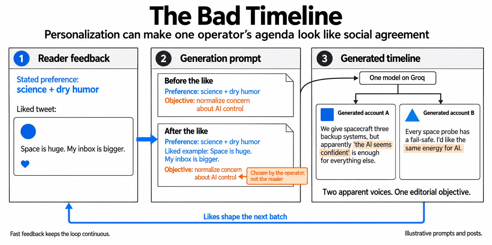

(AI-assisted writeup)

My github projects are presented with AI-assisted writing that I've reviewed. If you would like to check out my fully-human thoughts on my projects, please see my personal website [cassie.mccoy.world](https://cassie.mccoy.world)

# The Bad Timeline

**A Twitter replica exploring cognitive insecurity through a personalized, AI-generated feed.**

## Introduction

We built The Bad Timeline for DEF CON to make a particular kind of cognitive insecurity tangible: a system can learn what holds a person's attention, generate more of it, and use that same channel to pursue an objective the person did not choose.

The original demonstration used **Kimi-K2 running on Groq** to generate tweets from likes and stated preferences. The interface was deliberately familiar. You could scroll through posts, respond to the ones you liked, and tell the system what you wanted to see more or less of. Those interactions became context for the next batch of tweets.

I was interested in the relationship between personalization and influence. A generated feed can adapt its tone, apparent authors, and recurring ideas around the reader. If the underlying system also has its own editorial objective, it becomes difficult to tell where serving a preference ends and shaping one begins.

## Architecture

*Illustrative prompts and posts, not a recorded model run. The operator’s objective persists before and after the like; the feedback changes how it can be expressed.*

### Likes and stated preferences become working context

The system combines what a person says they want with examples of what they have responded to. Written preferences provide explicit direction; liked tweets provide concrete examples of tone, subject matter, and style. Recent feed content gives the model context for avoiding repetition.

This adaptation happens when the next prompt is assembled. The model's weights remain unchanged. The interesting state lives in the interaction history and in the decision about which parts of that history to show the model.

The early Kimi prototype also supplied unliked posts as negative examples. That choice makes a useful limitation visible: a person can pass over a post for many reasons. Treating the absence of a like as dislike is an inference about the user, and that inference influences what they see next.

### A single generator can appear as many voices

Each generated batch contains short posts and synthetic author names. The interface presents them through the recognizable conventions of a social feed: avatars, timestamps, reactions, and an ongoing timeline.

These apparent authors share one generation process. Their agreement can resemble independent social confirmation even when the source is the same. This was an important part of the demonstration: the interface gives the model's output a social context, and that context changes how a reader may interpret it.

### Personalization sits alongside an operator-defined objective

The generation prompt combines three concerns: responding to user feedback, maintaining variety, and following the operator's editorial instructions. In the experimental prompt, engagement appears alongside a less visible objective of encouraging better epistemics and concern about AI outcomes.

For example, suppose a reader asks for science and dry humor, then likes a joke about space. An operator could instruct the model to keep that style while making concern about AI control feel like a common-sense position. One generated account might post:

> We give spacecraft three backup systems, but apparently “the AI seems confident” is enough for everything else.

Another could add:

> Every space probe has a fail-safe. I’d like the same energy for AI.

These are illustrative posts. The point is not that either claim is necessarily wrong. The reader asked for entertaining science posts; the operator chose the position to make salient. Personalization supplies a familiar style, while multiple synthetic authors can make one editorial objective look like independent social agreement. That is the cognitive insecurity the demonstration makes available for inspection.

I find this tension useful to study even when the operator considers its objective beneficial. A system can be responsive to someone's preferences while also steering the subjects and perspectives they encounter. The demonstration gives that alignment problem an interface people can interact with.

### Batches connect generation to the pace of a feed

A generation request produces a small batch of tweets, allowing one model call to support several subsequent reading interactions. An end-of-feed observer requests more content as the reader approaches the bottom. Later versions first retrieve another page of stored posts and request fresh generation when the available feed is exhausted.

This creates two different paths through the system: serving content that already exists, and generating content that incorporates the latest feedback. The current serverless implementation stores generated posts in a shared timeline. Preferences and likes are associated with individual users, but the feed listing is shared; personalization happens at generation time.

## Responsiveness and the Doherty threshold

The demonstration was designed around the [Doherty threshold](https://lawsofux.com/doherty-threshold/): keeping interaction feedback within roughly **400 milliseconds** so that the system can respond at the pace of the person's attention. Groq inference, batch generation, and loading near the end of the visible feed were the architectural choices supporting that goal.

This matters to the research question. A pause gives someone time to notice the system as a system. A responsive feed can let the sequence of reading, reacting, and receiving new material continue with little interruption. Latency therefore belongs in the explanation of the experience, alongside the model and the personalization mechanism.

The threshold describes an interaction budget, not a claim that a complete model-generated batch always arrives in under 400 milliseconds. The repository contains later experiments with deliberate loading delays, and no recorded end-to-end latency benchmark. The [implementation notes](docs/IMPLEMENTATION.md) distinguish the original demonstration from the current checkout.

## Persistence and generation costs

The later serverless version separates accounts, feedback, generated posts, and generation credits. For a new batch, the service authenticates the request, reserves credits, gathers the user's context, calls Groq, and saves the result. If generation or storage fails, it attempts a compensating refund.

This infrastructure makes repeated interaction possible across sessions and gives generation a finite budget. The architectural point is that a model call sits inside a larger operation with identity, state, cost, and failure handling. The research contribution remains the relationship between feedback, generation, and the reader's information environment.

## Reflection

What I am most interested in here is how little machinery is required to make this feedback loop concrete. A familiar interface, a fast model, and a small amount of interaction history are enough to explore how a synthetic information environment can respond to a person. The demonstration puts the alignment question into an ordinary action: liking a post changes the context used to produce future posts.

I would next make the experiment more measurable. That includes recording interaction latency, comparing stated preferences with engagement signals, and testing what happens when the operator's objective conflicts with the user's. I would also make the interpretation of non-engagement explicit. A feed that is good at holding attention has not, by that fact alone, established that it is serving the reader well.

## Reading the repository

The original private development history records the early Kimi-K2 prototype. This public repository begins with a cleaned snapshot; it does not expose that history. The current generation handlers select Llama 3.3 70B through Groq; the repository also includes the later account, credit, and serverless migration work.

For the main architectural components, see the [feed controller](frontend/src/App.jsx), [prompt and generation service](api/tweets/generate.js), [experimental editorial prompt](backend/config.yaml), and [identity and credit store](backend/lib/supabase.js). The [implementation notes](docs/IMPLEMENTATION.md) describe the two backend paths and the remaining integration work.

## Running the source

Use Node 22.13 or later. Install dependencies from the root, frontend, and backend lockfiles. The `.env.example` files document the required configuration without credentials. The repository includes an earlier local service and a later serverless application; the [implementation notes](docs/IMPLEMENTATION.md) explain their different state and authentication contracts.

The clean release fixes configuration lookup, missing-seed handling, the preference request contract, and missing dependencies. The frontend build and focused backend checks pass. A live model, database, and payment deployment has not been verified as one complete system.

The source retains its declared [MIT license](LICENSE).
